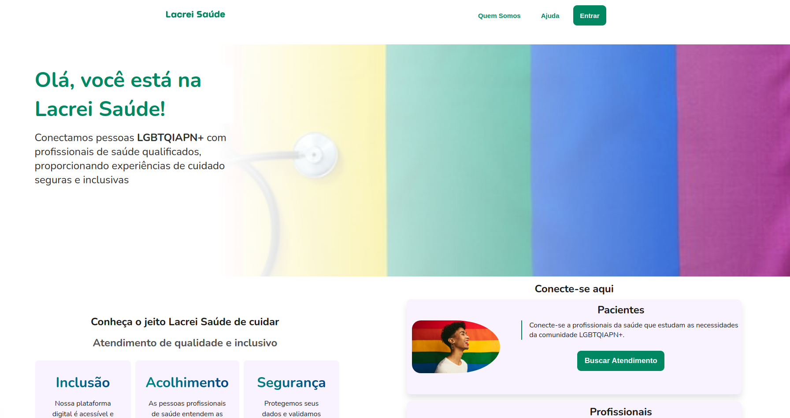
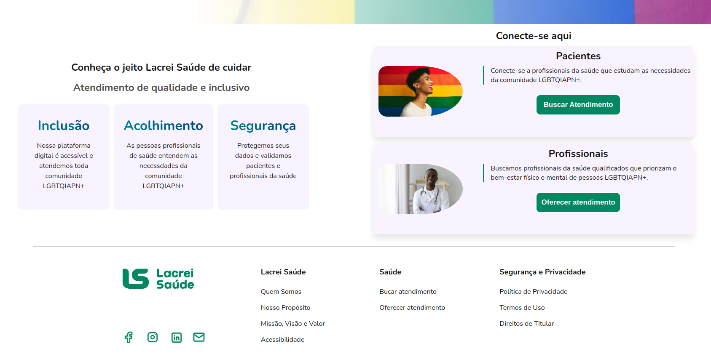
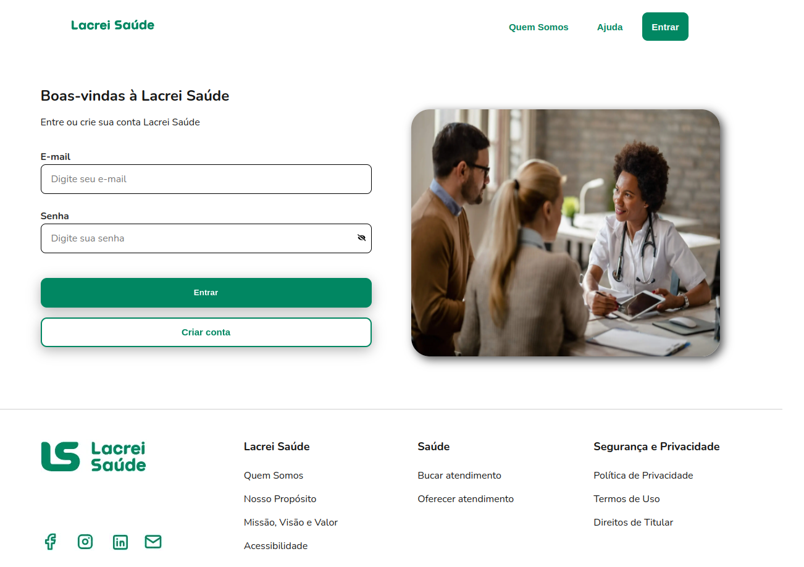

# DESAFIO REACT + NEXT LACREI SAÚDE

O repositório deste projeto visa resolver o desafio passado pela empresa Lacrei Saúde.

## Objetivo do desafio

O desafio pede para que criemos duas páginas web interativas, com roteamento entre elas, incorporando os seguintes elementos:

# Baixando este repositório

Primeiro clone o projeto na sua máquina com o comando:

```
git clone git@github.com:devLucasCBMelo/desafio-react-next-lacrei.git
```

entre na pasta do projeto com o comando:

```
cd desafio-react-next-lacrei
```

instale as dependências com o comando:

```
npm install
```

# Rodando a aplicação

Para rodar a aplicação, depois de instalar as dependências, rode o comando:

```
npm run dev
```

# A aplicação

## primeira página

No seu navegador, será possível visualizar a página de entrada da aplicação:



Os botões do header "Quem Somos" e "Ajuda" direcionam o usuário para as páginas respectivas próprias da Lacrei Saúde. O botão de "Entrar" não realiza nenhuma ação, sendo meramente ilustrativo.

Descendo um pouco temos a segunda parte da primeira página:



Aqui podemos ver os cards que mostram os valores da Lacrei Saúde e conseguimos acessar os botões para realizar a Busca por Atendimento ou Oferecer o Atendimento, por hora, ambos os botões direcionam para a mesma rota, que é a de cadastro.

## segunda página

Na rota "/register" temos a nossa tela de login onde o usuário pode realizá-lo, caso o tivesse, ou criar uma conta.



No input de E-mail o usuário pode digitar um e-mail que seja válido e no input de Password ele deve digitar uma senha de pelo menos 8 caracteres, enquanto ele não fizer isso o botão "Entrar" estará desabilitado.

Caso os dados sejam válidos e ele clique em "Entrar" aparecerá um Alert na tela dizendo que o login foi realizado com sucesso.
